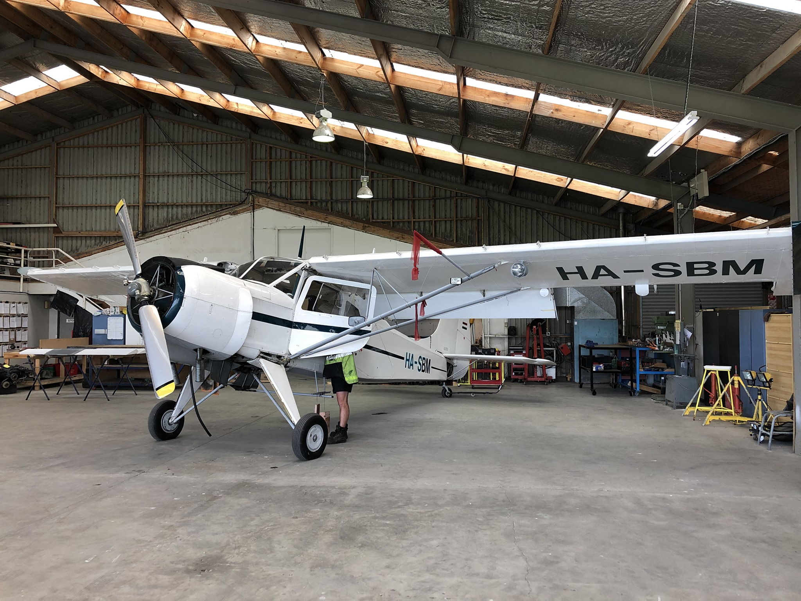

## Service Details

This is a space for a few more details about [title] and why Central Aero does such a good job. e.g.

We understand that the process of importing and assembling an aircraft can be complex and time-consuming, and we are here to streamline the entire process for you.

Our experienced team of aviation engineers and technicians has a deep understanding of the regulatory requirements and intricacies involved in aircraft importation. Whether you are importing a brand-new aircraft or bringing in a pre-owned one, we have the expertise to navigate the necessary paperwork, inspections, and compliance checks to ensure a smooth and hassle-free import process.

Once your aircraft has arrived, our skilled technicians will meticulously assemble all components, ensuring that everything is properly installed and integrated according to manufacturer specifications. Our attention to detail and adherence to industry best practices guarantee that your aircraft is assembled to the highest standards of safety and performance.

Obtaining the Certificate of Airworthiness is a critical step in the process, as it validates that your aircraft meets all regulatory standards and is safe for operation. Our team will work closely with the relevant aviation authorities to ensure that all necessary inspections and tests are conducted efficiently and effectively. We will assist you in addressing any potential issues or discrepancies to expedite the C of A issuance, enabling you to get your aircraft airborne as soon as possible.

### Central Aero Guarentee

At Central Aero, we pride ourselves on our commitment to excellence and our dedication to delivering exceptional results. We understand that the aviation industry demands precision, attention to detail, and uncompromising quality. That's why our highly skilled team of engineers, technicians, and support staff work diligently to ensure that every project we undertake is executed to the highest standards.

Contact us today to discuss your aviation engineering needs. Whether you require routine maintenance, specialized modifications, or professional guidance on aircraft operations, we are here to provide you with the reliable, efficient, and customer-focused service you deserve. Trust Central Aero as your partner in aviation engineering, and let us help you soar to new heights of success.